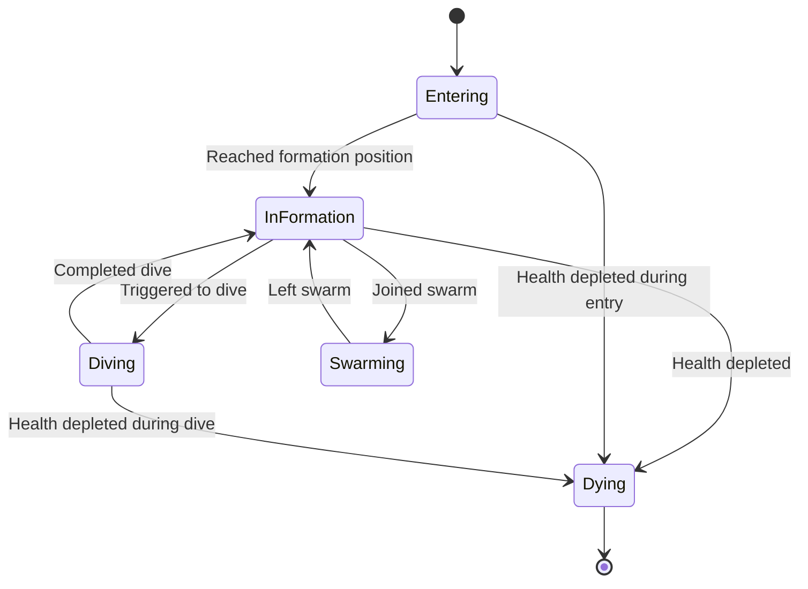
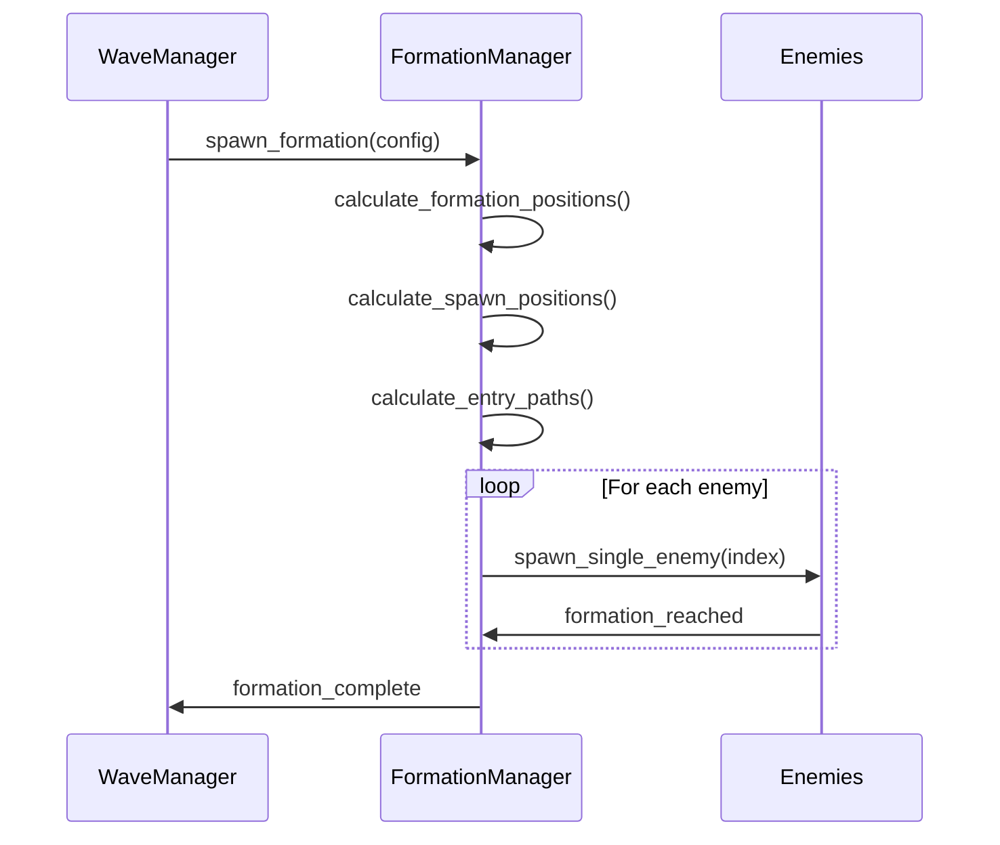

# Enemy Script Enhancement for Modern Alien Invader Gameplay

## Overview

This document outlines enhancements to the enemy scripts, formation manager, and wave manager to achieve a modern alien invader gameplay experience. The proposed changes will introduce more dynamic enemy behaviors, complex formation patterns, power-up systems, and weapon variations that capture the essence of popular modern alien shooter games while maintaining the existing architecture.

## Architecture

### Current System Components

1. **Enemy Base Class** (`Enemy.gd`): Handles core enemy functionality including health, movement patterns, shooting, and death logic
2. **Formation Manager** (`formation_manager.gd`): Manages enemy formations, spawn positions, and entry paths
3. **Wave Manager** (`wave_manager.gd`): Controls wave progression and enemy spawning sequences
4. **Wave Configuration** (`WaveConfig.gd`): Defines parameters for each wave including enemy types, formations, and difficulty

### Proposed Enhancements

The enhancements will focus on four main areas:
1. Enemy behavior and movement patterns
2. Formation complexity and entry patterns
3. Wave progression and special enemy types
4. Power-up systems and weapon variations

## Enemy Behavior Enhancements

### New Movement Patterns

Current movement patterns will be expanded to include modern alien invader behaviors:

1. **DIVE_BOMB_PATTERN**:
   - Enemies leave formation and dive straight down toward the player
   - Implementation in `Enemy.gd`:
     ```gdscript
     enum MovementPattern { 
         FORMATION_HOLD, 
         SIDE_TO_SIDE, 
         CIRCLE, 
         DIVE, 
         DIVE_BOMB_PATTERN  # New pattern
     }
     
     func _perform_formation_movement(delta: float):
         match movement_pattern:
             # ... existing patterns ...
             MovementPattern.DIVE_BOMB_PATTERN:
                 _handle_dive_bomb_pattern(delta)
     
     func _handle_dive_bomb_pattern(delta: float):
         if should_dive_bomb and not is_diving:
             is_diving = true
             dive_target = player_reference.global_position
             # Calculate dive path
         elif is_diving:
             # Execute dive toward player
     ```

2. **SWARM_PATTERN**:
   - Groups of enemies move in coordinated swarm patterns
   - Implementation in `Enemy.gd`:
     ```gdscript
     func _handle_swarm_pattern(delta: float):
         # Move in coordination with nearby enemies
         # Adjust position based on swarm center and separation forces
     ```

3. **AMBUSH_PATTERN**:
   - Enemies hide at screen edges and ambush the player
   - Implementation in `Enemy.gd`:
     ```gdscript
     func _handle_ambush_pattern(delta: float):
         # Hide at screen edges
         # Attack when player comes close
     ```

### Special Enemy Types

1. **Mini-Boss Enemies**:
   - Larger, more durable enemies with special attack patterns
   - Implementation in new `MiniBoss.gd` extending `Enemy.gd`

2. **Elite Enemies**:
   - High-damage enemies with unique behaviors
   - Appear in later stages for increased challenge
   - Implementation in new enemy scripts extending `Enemy.gd`

### Enhanced Shooting Patterns

1. **Aimed Shooting**:
   - Enemies shoot directly at player position
   - Implementation in `Enemy.gd`:
     ```gdscript
     func _handle_shooting(_delta: float):
         if not arrived_at_formation or not is_instance_valid(player_reference):
             return
         
         # Shoot directly at player
         if _should_shoot():
             _fire_at_player()
     
     func _should_shoot():
         # Check if enough time has passed since last shot
         return true  # Simplified for example
     ```

2. **Spread Shot Pattern**:
   - Enemies fire multiple bullets in a spread pattern
   - Implementation in `Enemy.gd`:
     ```gdscript
     func _fire_spread_shot(bullet_count: int = 3, spread_angle: float = PI/4):
         for i in range(bullet_count):
             var bullet_scene = SHADOW_EBULLET if is_shadow_enemy else EBULLET
             var bullet = bullet_scene.instantiate()
             
             # Calculate spread angle
             var angle_offset = spread_angle * (i - (bullet_count-1)/2.0) / (bullet_count-1)
             var direction = (player_reference.global_position - global_position).normalized()
             direction = direction.rotated(angle_offset)
             
             bullet.global_position = global_position
             bullet.rotation = direction.angle() + PI/2
             get_tree().current_scene.add_child(bullet)
     ```

3. **Burst Fire Pattern**:
   - Enemies fire multiple shots in quick succession
   - Implementation in `Enemy.gd`:
     ```gdscript
     func _fire_burst_shot(burst_count: int = 3, burst_delay: float = 0.1):
         # Fire multiple shots with delay between each
         # Implementation would use a timer to fire shots sequentially
     ```

## Formation Manager Enhancements

### Complex Formation Patterns

1. **V-Formation with Waves**:
   - Enemies arranged in V-shaped formations with wave-like movement
   - Implementation in `formation_manager.gd`:
     ```gdscript
     func _calculate_v_wave_formation(enemy_count: int, center: Vector2, spacing: float):
         var rows = ceil(sqrt(enemy_count))
         var cols = ceil(float(enemy_count) / rows)
         
         for i in range(enemy_count):
             var row = i / cols
             var col = i % int(cols)
             
             # Create wave pattern
             var wave_offset = sin(row * 0.5) * spacing
             var pos = center + Vector2(col * spacing - (cols * spacing / 2), row * spacing + wave_offset)
             formation_positions.append(pos)
     ```

2. **Cluster Formation**:
   - Enemies grouped in tight clusters that move together
   - Implementation in `formation_manager.gd`:
     ```gdscript
     func _calculate_cluster_formation(enemy_count: int, center: Vector2, cluster_size: int = 5):
         var clusters = ceil(float(enemy_count) / cluster_size)
         
         for c in range(clusters):
             var cluster_center = Vector2(
                 center.x + (c % 3 - 1) * 200,
                 center.y + (c / 3) * 150
             )
             
             var cluster_count = min(cluster_size, enemy_count - c * cluster_size)
             for i in range(cluster_count):
                 var angle = i * (2 * PI / cluster_count)
                 var pos = cluster_center + Vector2(cos(angle) * 50, sin(angle) * 50)
                 formation_positions.append(pos)
     ```

3. **Dynamic Formation**:
   - Formations that change shape during gameplay
   - Implementation in `formation_manager.gd`:
     ```gdscript
     func _calculate_dynamic_formation(enemy_count: int, center: Vector2, time: float):
         # Formation positions change over time
         for i in range(enemy_count):
             var angle = i * (2 * PI / enemy_count) + time * 0.5
             var radius = 100 + sin(time + i) * 50
             var pos = center + Vector2(cos(angle) * radius, sin(angle) * radius)
             formation_positions.append(pos)
     ```

### Advanced Entry Patterns

1. **Staggered Entry**:
   - Enemies enter in groups with delays between groups
   - Implementation in `formation_manager.gd`:
     ```gdscript
     func _calculate_staggered_entry_paths(enemy_count: int, group_size: int = 5):
         # Calculate entry paths for staggered group entry
         var groups = ceil(float(enemy_count) / group_size)
         
         for g in range(groups):
             var group_start = g * group_size
             var group_end = min((g + 1) * group_size, enemy_count)
             
             # Add delay for each group
             for i in range(group_start, group_end):
                 # Same path for group members but with timing offset
                 pass
     ```

2. **Ambush Entry**:
   - Some enemies enter from screen edges to surprise the player
   - Implementation in `formation_manager.gd`:
     ```gdscript
     func _calculate_ambush_entry_paths(enemy_count: int, ambush_count: int = 3):
         # Calculate standard entry paths for most enemies
         # Calculate edge entry paths for ambush enemies
         for i in range(ambush_count):
             # Special paths from screen edges
             pass
     ```

## Wave Manager Enhancements

### Dynamic Wave Progression

1. **Adaptive Difficulty**:
   - Adjust enemy count and types based on player performance
   - Implementation in `wave_manager.gd`:
     ```gdscript
     func _adjust_wave_difficulty(player_performance: float):
         # Modify enemy count, health, and shooting frequency based on player performance
         # player_performance: 0.0 (struggling) to 1.0 (excelling)
     ```

2. **Event-Based Waves**:
   - Special waves triggered by in-game events
   - Implementation in `wave_manager.gd`:
     ```gdscript
     func _trigger_event_wave(event_type: String):
         # Spawn special enemy formations based on events
         # Examples: Boss rushes, swarm attacks, elite enemy appearances
     ```

### Special Enemy Spawning

1. **Elite Enemy Spawning**:
   - Spawn high-value enemies with special rewards
   - Implementation in `wave_manager.gd`:
     ```gdscript
     func _spawn_elite_enemy():
         # Create an elite enemy with enhanced stats and rewards
     ```

2. **Swarm Spawning**:
   - Spawn large groups of weaker enemies
   - Implementation in `wave_manager.gd`:
     ```gdscript
     func _spawn_enemy_swarm(count: int, enemy_type: String):
         # Spawn a swarm of enemies
     ```

## Data Models & Configuration

### Enhanced WaveConfig

The `WaveConfig.gd` will be enhanced to support new formation types and enemy behaviors:

```gdscript
# New formation types
enum FormationType {
    CIRCLE,
    GRID,
    V_FORMATION,
    DIAMOND,
    V_WAVE,         # New
    CLUSTER,        # New
    DYNAMIC         # New
}

# New entry patterns
enum EntryPattern {
    SIDE_CURVE,
    TOP_DIVE,
    STAGGERED,      # New
    AMBUSH          # New
}

# New enemy types
@export_enum("mob1", "mob2", "mob3", "mob4", "SlowShooter", "FastEnemy", "BouncerEnemy", "BomberBug", "MiniBoss", "EliteEnemy")
var enemy_type: String = "mob1"
```

### Enemy Behavior Configuration

Enemies will have new configuration options for modern alien invader behaviors:

```gdscript
# In Enemy.gd
@export var dive_bomb_probability: float = 0.1
@export var swarm_coherence: float = 0.8
@export var ambush_probability: float = 0.15
@export var elite_spawn_probability: float = 0.05
```

## Business Logic Layer

### Enemy State Management

Enhanced state management for enemies to handle complex behaviors:



### Formation Building Logic

Enhanced logic for building and maintaining formations:



## Middleware & Interceptors

### Power-Up System

A new power-up system will be implemented to enhance gameplay:

1. **Enemy-Dropped Power-Ups**:
   - Enemies have a chance to drop power-ups when destroyed
   - Different enemy types drop different power-ups
   - Implementation in `Enemy.gd`:
     ```gdscript
     func _drop_powerup():
         if randf() < powerup_drop_chance:
             var powerup = POWERUP_SCENE.instantiate()
             powerup.global_position = global_position
             get_tree().current_scene.add_child(powerup)
     ```

2. **Power-Up Types**:
   - Weapon upgrades
   - Shield enhancements
   - Score multipliers
   - Implementation in new `PowerUp.gd` script

### Event System Enhancements

Enhanced event system to handle new enemy behaviors:

1. **Swarm Events**:
   - Signal when enemies form swarms
   - Signal when swarms disperse
   - Implementation in `Enemy.gd`

2. **Power-Up Events**:
   - Signal when power-ups are collected
   - Signal when power-up effects expire
   - Implementation in new `PowerUp.gd` script

## API Endpoints Reference

### Enemy Script API

#### Movement Pattern Methods
- `_handle_dive_bomb_pattern(delta: float)`: Handle dive bomb movement
- `_handle_swarm_pattern(delta: float)`: Handle swarm movement
- `_handle_ambush_pattern(delta: float)`: Handle ambush movement

#### Shooting Pattern Methods
- `_fire_spread_shot(bullet_count: int, spread_angle: float)`: Fire bullets in spread pattern
- `_fire_burst_shot(burst_count: int, burst_delay: float)`: Fire bullets in burst pattern

### Formation Manager API

#### Formation Calculation Methods
- `_calculate_v_wave_formation(enemy_count: int, center: Vector2, spacing: float)`: Calculate V-wave formation
- `_calculate_cluster_formation(enemy_count: int, center: Vector2, cluster_size: int)`: Calculate cluster formation
- `_calculate_dynamic_formation(enemy_count: int, center: Vector2, time: float)`: Calculate dynamic formation

#### Entry Path Methods
- `_calculate_staggered_entry_paths(enemy_count: int, group_size: int)`: Calculate staggered entry paths
- `_calculate_ambush_entry_paths(enemy_count: int, ambush_count: int)`: Calculate ambush entry paths

### Wave Manager API

#### Wave Spawning Methods
- `_adjust_wave_difficulty(player_performance: float)`: Adjust difficulty based on player performance
- `_trigger_event_wave(event_type: String)`: Trigger special event-based waves
- `_spawn_elite_enemy()`: Spawn elite enemy
- `_spawn_enemy_swarm(count: int, enemy_type: String)`: Spawn swarm of enemies

## Testing

### Unit Tests for Enemy Behaviors

1. **Movement Pattern Tests**:
   - Test dive bomb pattern execution
   - Test swarm pattern coordination
   - Test ambush pattern hiding and attacking

2. **Shooting Pattern Tests**:
   - Test aimed shooting accuracy
   - Test spread shot bullet distribution
   - Test burst fire timing

### Integration Tests for Formation System

1. **Formation Building Tests**:
   - Test V-wave formation calculation
   - Test cluster formation calculation
   - Test dynamic formation calculation

2. **Entry Path Tests**:
   - Test staggered entry path generation
   - Test ambush entry path generation

### System Tests for Wave Progression

1. **Wave Type Tests**:
   - Test adaptive difficulty adjustment
   - Test event-based wave triggering
   - Test elite enemy spawning

2. **Power-Up System Tests**:
   - Test power-up dropping from enemies
   - Test power-up collection and effects
   - Test power-up expiration