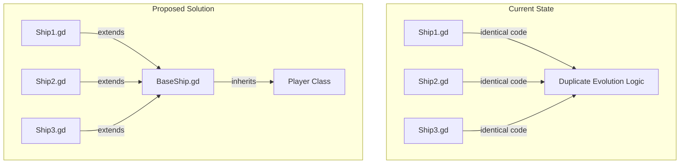
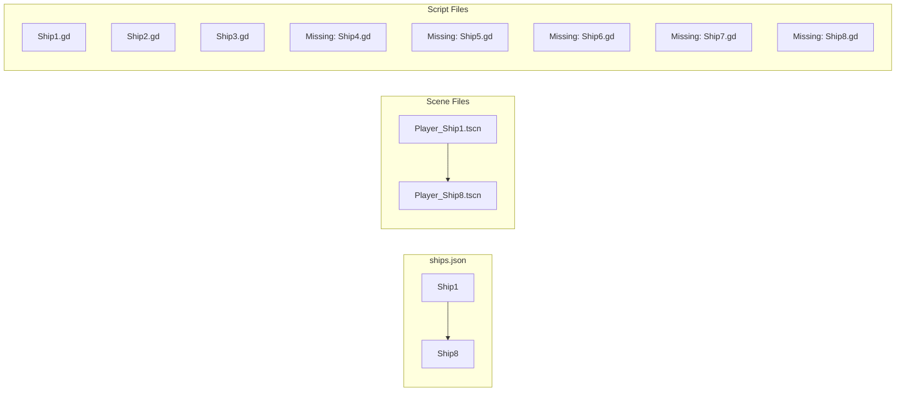
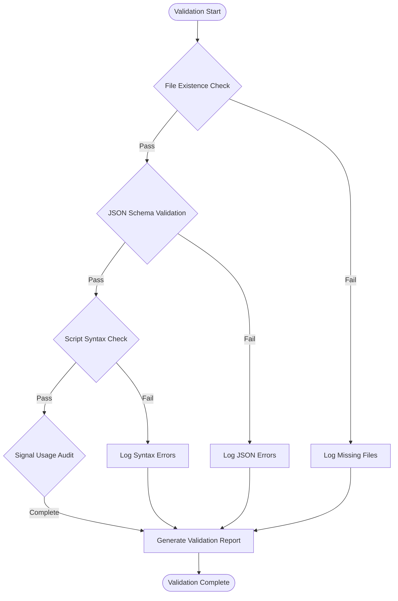

# Shadow Avenger - Code Validation and Cleanup Design

## Overview

This document outlines a comprehensive validation and cleanup strategy for the Shadow Avenger codebase to identify and remediate broken code, redundant implementations, and unused assets. The analysis focuses on improving code quality, performance, and maintainability while ensuring system reliability.

## Technology Stack

**Engine**: Godot 4.3  
**Primary Language**: GDScript  
**Configuration Format**: JSON  
**Architecture Pattern**: Singleton-based Manager System  

## Validation Categories

### 1. Code Structure Validation

#### 1.1 Redundant Ship Scripts
**Issue Identified**: Ship1.gd, Ship2.gd, and Ship3.gd contain identical code implementations
**Location**: `Ships/Scripts/Ship1.gd`, `Ships/Scripts/Ship2.gd`, `Ships/Scripts/Ship3.gd`



**Cleanup Action**: Create a base ship class to eliminate code duplication

#### 1.2 Missing Ship Scripts
**Issue Identified**: Missing ship script files for Ship4-Ship8
**Expected Location**: `Ships/Scripts/Ship4.gd` through `Ships/Scripts/Ship8.gd`
**Current State**: Only Ship1.gd, Ship2.gd, Ship3.gd exist
**Impact**: Ships 4-8 defined in ships.json but lack corresponding script implementations

#### 1.3 Minimal Effect Scripts
**Issue Identified**: Trivial effect scripts with single-function implementations
**Files**:
- `Bullet/Scripts/BulletEffect.gd` (5 lines)
- `Bullet/Scripts/Enemy_Bullet_Effect.gd` (5 lines)

**Cleanup Action**: Consider consolidating into a generic EffectBase class

### 2. Data Consistency Validation

#### 2.1 Ship Configuration Inconsistencies
**JSON Configuration**: `data/ships.json` defines 8 ships (Ship1-Ship8)
**Scene Files**: Only 8 Player_Ship scene files exist
**Script Files**: Only 3 ship script files exist (Ship1-Ship3)



#### 2.2 Texture Path Validation
**Requirement**: Validate all texture paths referenced in ships.json exist in filesystem
**Validation Target**: `res://Textures/player/ship_textures/` directory

#### 2.3 JSON Schema Integrity
**Issue Identified**: Ship8 in ships.json has incomplete texture definitions
**Location**: Line 176 - missing `upgrade_6` texture entry

### 3. Signal and Connection Validation

#### 3.1 Unused Signal Warnings
**Issue Identified**: Multiple signals marked with `@warning_ignore("unused_signal")` in GameManager.gd
**Affected Signals**:
- `ad_reward_granted`
- `scene_change_started`
- `level_unlocked`
- `wave_started`
- `all_waves_cleared`
- `level_completed`
- `shadow_mode_activated`
- `level_star_earned`
- `ad_failed_to_load`
- `revive_completed`

**Validation Action**: Audit signal usage across codebase to determine if truly unused

### 4. Deprecated Code Patterns

#### 4.1 Godot 3.x Compatibility Code
**Issue Identified**: Legacy Tween cleanup code in enemy scripts
**Files**:
- `Enemy/Scripts/bomber_bug.gd`
- `Enemy/Scripts/mob.gd`

**Legacy Pattern**:
```gdscript
func _exit_tree():
    for child in get_children():
        if child.get_class() == "Tween":
            child.kill()
```

**Cleanup Action**: Remove Godot 3.x Tween cleanup code as Godot 4.x uses different tween system

#### 4.2 Outdated Function Naming
**Issue Identified**: Inconsistent timer signal naming
**Files**: `BulletEffect.gd` vs `Enemy_Bullet_Effect.gd`
- `_on_Timer_timeout()` (PascalCase)
- `_on_timer_timeout()` (snake_case)

### 5. Performance and Memory Validation

#### 5.1 Manager Initialization Order
**Current Implementation**: Managers initialized sequentially in GameManager._ready()
**Potential Issue**: Dependencies between managers not explicitly declared
**Validation**: Ensure initialization order handles manager dependencies correctly

#### 5.2 Scene Loading Patterns
**Analysis Target**: SceneManager implementation for resource loading efficiency
**Validation**: Check for memory leaks in scene transitions

### 6. Asset and Resource Validation

#### 6.1 Unused Scene Files
**Potential Candidates**:
- Scene files without corresponding script references
- Test scenes not referenced in production code

#### 6.2 Texture Asset Optimization
**Validation Target**: Texture compression and format consistency
**Analysis**: Verify texture import settings match mobile optimization requirements

## Cleanup Implementation Strategy

### Phase 1: Critical Issues Resolution
1. **Missing Ship Scripts**: Create Ship4.gd through Ship8.gd implementations
2. **JSON Data Integrity**: Fix incomplete texture definitions in Ship8
3. **Path Validation**: Verify all referenced texture paths exist

### Phase 2: Code Consolidation
1. **Ship Script Refactoring**: Create BaseShip class to eliminate duplication
2. **Effect Script Consolidation**: Implement generic EffectBase class
3. **Legacy Code Removal**: Remove Godot 3.x compatibility code

### Phase 3: Signal Optimization
1. **Signal Usage Audit**: Determine unused signals and remove or implement
2. **Connection Validation**: Ensure all signal connections are properly established
3. **Event System Review**: Validate signal-based communication patterns

### Phase 4: Performance Optimization
1. **Manager Dependencies**: Document and optimize initialization order
2. **Resource Loading**: Implement efficient scene loading patterns
3. **Memory Management**: Add resource cleanup verification

## Validation Tools and Techniques

### Automated Validation Scripts


### Manual Review Checklist
1. **Script Dependencies**: Verify all script references are valid
2. **Scene Integrity**: Check scene node structure consistency
3. **Resource Paths**: Validate all asset path references
4. **Manager Communication**: Review singleton interaction patterns

## Testing Strategy

### Unit Testing Approach
1. **Manager Isolation Testing**: Test each manager independently
2. **Signal Flow Testing**: Verify signal emission and reception
3. **Resource Loading Testing**: Validate scene and asset loading

### Integration Testing
1. **Manager Interaction Testing**: Test cross-manager communication
2. **Scene Transition Testing**: Verify seamless scene changes
3. **Save/Load Testing**: Validate data persistence integrity

### Performance Testing
1. **Memory Usage Monitoring**: Track memory consumption patterns
2. **Frame Rate Analysis**: Identify performance bottlenecks
3. **Resource Loading Timing**: Measure asset loading performance

## Success Metrics

### Code Quality Metrics
- **Duplicate Code Reduction**: Target 90% elimination of redundant code
- **Missing Implementation Coverage**: 100% completion of missing ship scripts
- **Signal Usage Optimization**: Remove all unused signals or implement functionality

### Performance Metrics
- **Memory Usage**: Reduce memory footprint by eliminating unused resources
- **Loading Times**: Maintain or improve scene transition performance
- **Frame Rate Stability**: Ensure no performance regressions

### Maintainability Metrics
- **Code Consistency**: Standardize naming conventions and patterns
- **Documentation Coverage**: Complete documentation for all manager classes
- **Test Coverage**: Implement unit tests for critical components