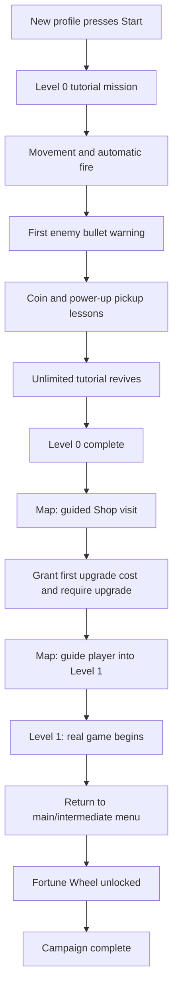

# First-Player Tutorial Campaign

## Goal

Teach the core loop through safe, live gameplay rather than detached text screens. The campaign applies only to brand-new profiles and ends after the player completes Level 1 and sees the Fortune Wheel unlock.

Existing or legacy profiles must never be forced into this campaign. They keep their current progress and may use a future replay option instead.

## Player flow



## Eligibility and persistence

`SaveManager.tutorial_state` is the source of truth.

- New/reset profile: `eligible_for_automatic_tutorials = true` and `campaign_stage = "level0_intro"`.
- Existing schema saves without tutorial metadata: migrate to `campaign_stage = "complete"` and automatic tutorials disabled.
- Legacy sequential saves: migrate to `campaign_stage = "complete"` and automatic tutorials disabled.
- Save after every completed stage, upgrade grant, and unlock transition.
- Scene changes and app restarts resume the next unfinished safe stage; they must not repeat an already completed lesson.

Recommended campaign stages:

```text
level0_intro
level0_first_bullet
level0_coin_pickup
level0_powerup_pickup
level0_complete
shop_entry
shop_upgrade
level1_entry
level1_complete
wheel_intro
complete
```

Independent one-time lessons are also recorded under `tutorial_state.completed`:

```text
overclock_explained
shadow_map_intro
shadow_charge_explained
shadow_activated
```

## Tutorial manager responsibilities

`TutorialManager` owns the campaign state and presentation requests. Gameplay systems emit facts; the manager decides whether a lesson should begin.

It must provide:

- Avatar dialogue, typewriter text, Next, Skip, dimmer, target highlight, arrow, and optional time slow/pause.
- Input gating: permit only the required player action or UI control during directed steps.
- Safe pause handling that does not open the normal pause menu.
- A target-control mode for map, Shop, and Shadow Mode button prompts.
- A tutorial-protected Level 0 mode that suppresses ordinary Game Over.
- Event subscriptions that disconnect on scene change or tutorial completion.

## Level 0 tutorial mission

Level 0 is a dedicated scripted mission, not a normal replayable level.

1. Adrian introduces movement and explains that the ship fires automatically.
2. Player moves their ship to continue.
3. A safe first enemy group establishes automatic fire.
4. When the first enemy bullet is spawned, pause the action, highlight the projectile, and explain that enemy fire is dangerous.
5. Spawn a marked tutorial coin. Slow time, highlight it, and require collection. Explain that coins pay for upgrades.
6. Spawn a marked Attack Boost power-up. Slow time, highlight it, and require collection. Explain that it raises firepower.
7. Finish the scripted wave and transition to the map.

Only marked tutorial drops should trigger these lessons. Random drops must not interrupt the mission.

### Tutorial death and revive

During Level 0, player death must not call the standard Game Over flow.

- Play the normal destruction feedback.
- Wait briefly and revive the ship with full lives.
- Show Adrian's revive message every time: the commander saved the pilot this time, but they should avoid dying again.
- Resume the current Level 0 step without resetting completed lesson state.

Normal death, ads, crystal revives, and Game Over behavior remain unchanged outside Level 0.

## Required gameplay events

Add narrow events instead of having the tutorial scan arbitrary scene nodes.

| Event | Emitted by | Used for |
| --- | --- | --- |
| `enemy_bullet_spawned(bullet)` | Enemy combat spawn code | First projectile warning |
| `tutorial_pickup_spawned(kind, pickup)` | Level 0 scripted spawner | Coin and Attack Boost lessons |
| `tutorial_pickup_collected(kind)` | Coin, crystal, and power-up scripts | Resume after collection |
| `shadow_mode_ready` | `ShadowModeButton` | Require first activation in Level 6 |
| `shadow_mode_activated` | Existing `GameManager` signal | Complete Shadow Mode lesson |
| `ship_stats_updated` | Existing `GameManager` signal | Detect maximum firepower/Overclock |
| `tutorial_upgrade_completed` | Upgrade transaction service | Advance guided Shop step |

## Guided map and Shop sequence

After Level 0:

1. Return to the map and highlight the Shop button. Disable or block unrelated navigation.
2. Enter the Shop and select the intended first ship upgrade.
3. Grant exactly the missing amount needed for that upgrade, once. New-player starting resources should be reviewed so the grant feels like an intentional initial investment rather than surplus currency.
4. Lock unrelated purchases until the required upgrade succeeds.
5. Highlight the Shop exit/back button.
6. On the map, allow only Level 1 and explain that the real game begins.

The upgrade grant must be persisted before purchase so restart/reload cannot duplicate it.

## Overclock lesson

The current attack level caps at `max_attack_level` (currently represented by four HUD power symbols).

When the player collects the final Attack Boost and reaches the cap for the first time:

1. Slow time and highlight the full power-symbol row.
2. Explain: damage cannot increase past Overclock; later Attack Boost pickups become score.
3. Mark `overclock_explained` complete.

Gameplay change required: if an Attack Boost is collected at the cap, award a configurable `overclock_score_reward` and show score feedback. It must not merely discard the pickup.

## Shadow Mode tutorial

Replace the current text-only Level 5 tutorial with a two-part guided sequence for eligible new profiles.

### After Level 5

- Unlock Shadow Mode normally.
- Return to the map.
- Show the Shadow Mode unlock presentation with Adrian.
- Highlight/permit Level 6 as the required next mission.

### During Level 6

1. Explain that defeating enemies fills the Shadow Mode gauge.
2. Let the player earn charge through the normal `enemy_killed` flow.
3. When the button reaches `READY!`, pause or slow time and highlight only the Shadow Mode button.
4. Require the player to activate it once.
5. On `shadow_mode_activated`, explain the temporary speed and fire-rate boost, restore normal controls, and mark the Shadow tutorial complete.

Existing players never see this forced sequence. If they unlock Shadow Mode after migration, preserve the normal unlock and map transition without showing tutorial dialogue.

## Completion and Fortune Wheel

On the first Level 1 completion while `campaign_stage = "level1_entry"`:

1. Return to the main/intermediate menu instead of leaving the player in the normal level loop.
2. Unlock the Fortune Wheel with a new persisted unlock flag if one does not already exist.
3. Show one short Wheel introduction.
4. Set `campaign_stage = "complete"` and release the player into normal progression.

## Implementation order

1. Extend persistence with campaign stages, migration, one-time rewards, and Wheel state.
2. Refactor `TutorialManager` to support event steps, highlights, input gates, and time control.
3. Build and configure the dedicated Level 0 scripted mission.
4. Add tutorial-safe death/revive and narrow gameplay events.
5. Implement map/Shop gating and the initial upgrade grant.
6. Implement Level 1 completion and Wheel unlock sequence.
7. Implement Overclock conversion plus its first-time lesson.
8. Replace the Level 5 text screen with the map-and-Level-6 Shadow Mode sequence.
9. Test new, migrated, restarted, death-loop, skipped, and resumed profiles on mobile and desktop layouts.

## Acceptance checks

- A new profile cannot accidentally skip required campaign steps through back buttons, scene changes, or death.
- A progressed profile never receives automatic onboarding, Shop gating, Overclock, or Shadow Mode tutorial interruptions.
- Level 0 survives unlimited player deaths without showing Game Over.
- The first bullet, coin, Attack Boost, Overclock, Shadow charge, and Shadow activation lessons appear once and only at safe moments.
- Extra Attack Boosts at Overclock award score instead of damage.
- The Shop grant cannot be duplicated with restart or repeated menu entry.
- Shadow Mode can still be used normally after its first guided activation.
